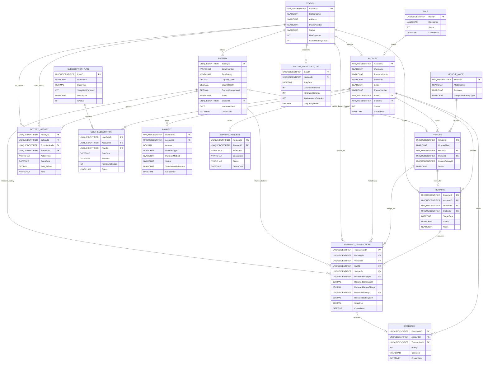

# EVBatterySwap Mermaid ERD

Source SQL schema: `../SWP_EVBatteryChangeStation_BE/Database/EVBatterySwap.sql`

## Notes

- `Vehicle.CurrentBatteryID` is shown as a logical relation for the ERD. In the current SQL, it is not declared as a foreign key.
- `BatteryHistory` references `Station` twice to represent move origin and move destination.
- `SwappingTransaction` references `Battery` twice to separate returned battery and released battery.
- Trigger logic such as `trg_Battery_LocationChange` is not represented in Mermaid ERD and should stay in SQL documentation.
