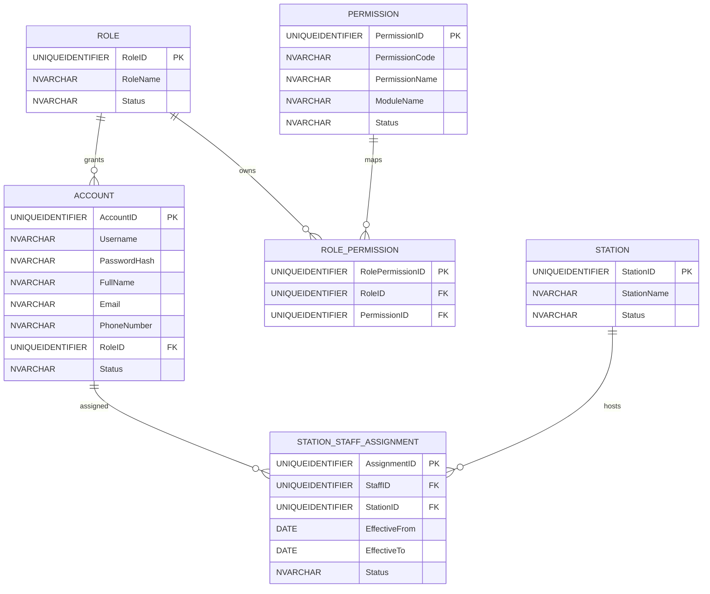
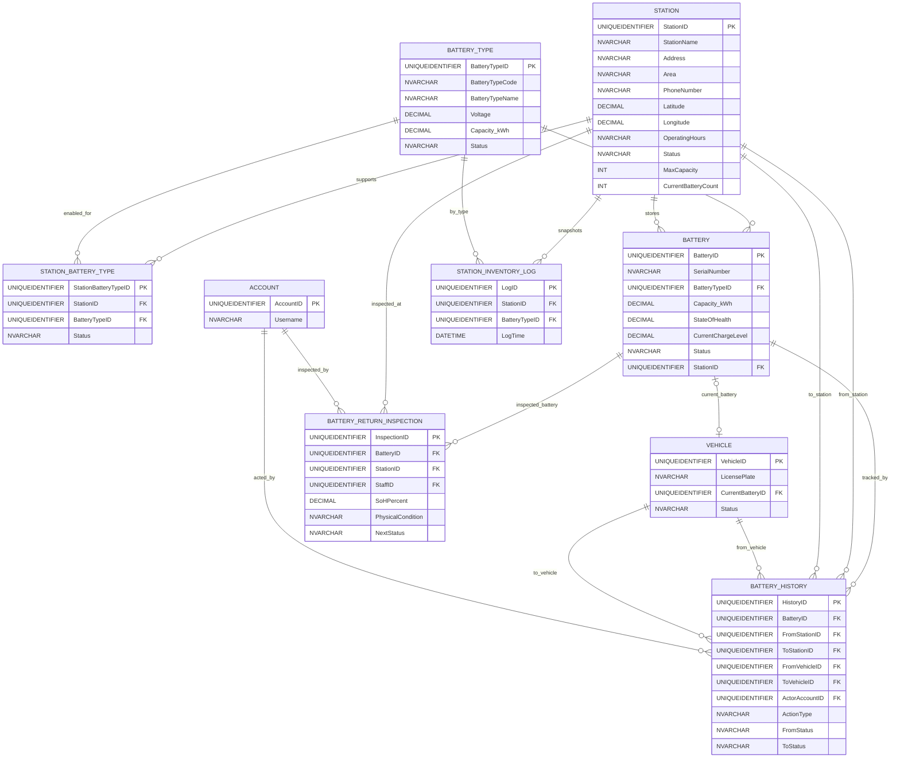
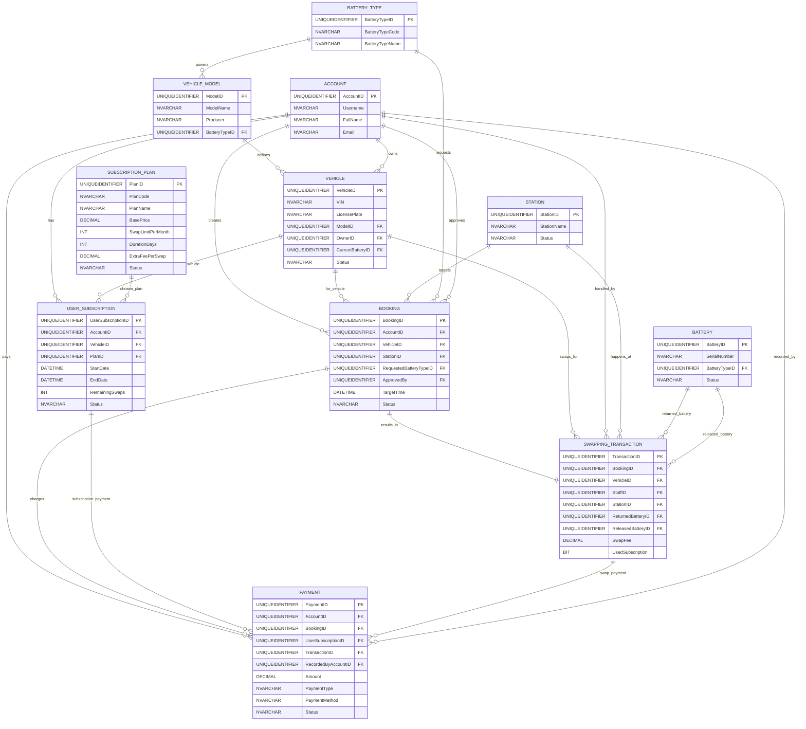
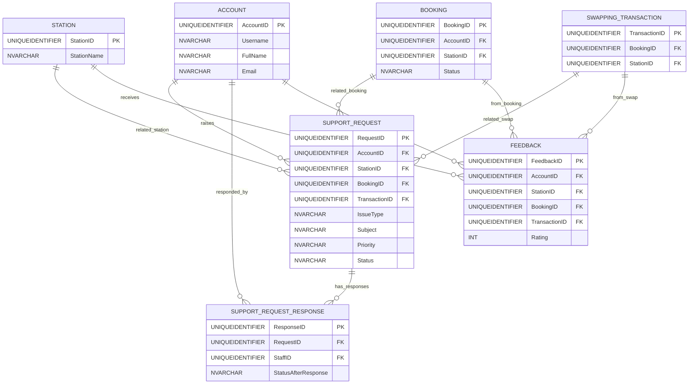

# EVBatterySwap v2 Mermaid ERD

Source SQL schema: `../SWP_EVBatteryChangeStation_BE/Database/EVBatterySwap_v2.sql`

This file is split by module so it is easier to preview and zoom.

## 1. Access Control

## 2. Station, Battery, Inventory

## 3. Vehicle, Subscription, Booking, Swap, Payment

## 4. Support, Response, Feedback

## Notes

- This ERD reflects the target schema `EVBatterySwap_v2.sql`, not the legacy `EVBatterySwap.sql`.
- `StationStaffAssignment` replaces a hard-coded station link on `Account`.
- `SupportRequestResponse` is separated so response history stays auditable.
- If this is still crowded, split each section into standalone files such as `DB_Station.md`, `DB_Swap.md`, and `DB_Support.md`.
